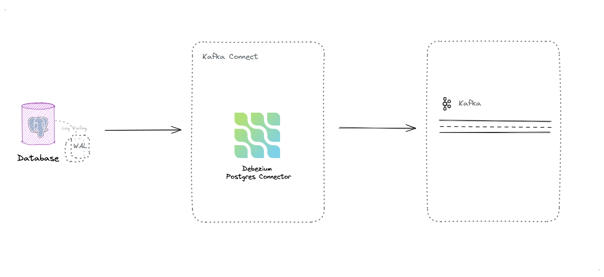
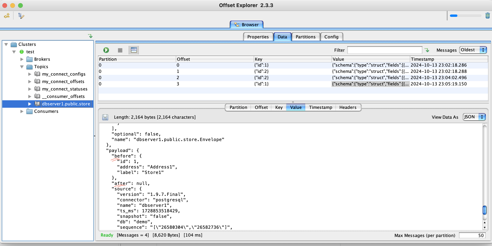

# Debezium PostgreSQL CDC with Kafka

> [!NOTICE]
> This project demonstrates how to set up Change Data Capture (CDC) from PostgreSQL to Kafka using [Debezium](https://debezium.io/).





## About

[Debezium](https://debezium.io/) is a distributed platform that leverages Change Data Capture ([CDC](https://en.wikipedia.org/wiki/Change_data_capture)) features in databases like PostgreSQL to enable real-time data streaming.
It provides Kafka Connect connectors that capture row-level changes in database tables and convert them into event streams sent to Apache Kafka.


> This powerful tool allows to build robust, scalable, and event-driven data pipelines, facilitating real-time data integration and microservices communication.


## Setting Up the Data Pipeline


This project sets up a real-time data pipeline using Docker containers orchestrated by Docker Compose. The pipeline consists of the following components:

- PostgreSQL: The source database where changes are captured.
- Apache Kafka: A distributed streaming platform that acts as the central hub for our data pipeline.
- Apache Zookeeper: Required for managing Kafka brokers.
- Kafka Connect workers: These run the Debezium connector, capturing changes from PostgreSQL and streaming them to Kafka.

[!NOTE]
> This containerized approach allows for quick setup and teardown of the entire data pipeline, making it ideal for demonstration purposes.
> While it provides a foundation for understanding CDC concepts, additional considerations would be needed for production deployments.


#### Prerequisites

- Docker and Docker Compose
- curl (for sending HTTP requests)
- PostgreSQL client like [DBeaver](https://dbeaver.io/) (for direct database access)
-----
#### Project Structure

The project is organized as follows:
```
project-root/ 
│ ├── scripts/ 
    │ ├── docker-compose.yml 
    │ ├── init-db.sql 
    │ ├── connectors  
        └── debezium-connector-config.json 
│── src/
    └── SpringBootApplication.java       #       
│── README.md
```
The `scripts/` folder is the main directory containing the Docker Compose file and Debezium connector configuration.

-----

To start the data pipeline, simply run:

```bash
cd scripts
docker-compose up -d
```
This command will download the necessary Docker images, create the containers, and start all the services.

After the services are up and running, you need to register the Debezium connector configuration:
```bash
curl -i -X POST -H "Accept:application/json" -H "Content-Type:application/json" localhost:8083/connectors/ -d @connectors/debezium-connector-config.json
```


Once this step is completed, you'll have a fully functional CDC pipeline ready to capture and stream data changes from PostgreSQL to Kafka.


-----

### Troubleshooting

#### Configuring Full Replica Identity

> [!NOTE]
> To ensure that all fields are captured during DELETION events, you need to set the **REPLICA IDENTITY** to **FULL** for the tables you want to monitor. 
> This step is crucial for retrieving all fields when a row is deleted.

After your database is up and running, execute the following SQL command:

```sql
ALTER TABLE store REPLICA IDENTITY FULL;
```



-----


